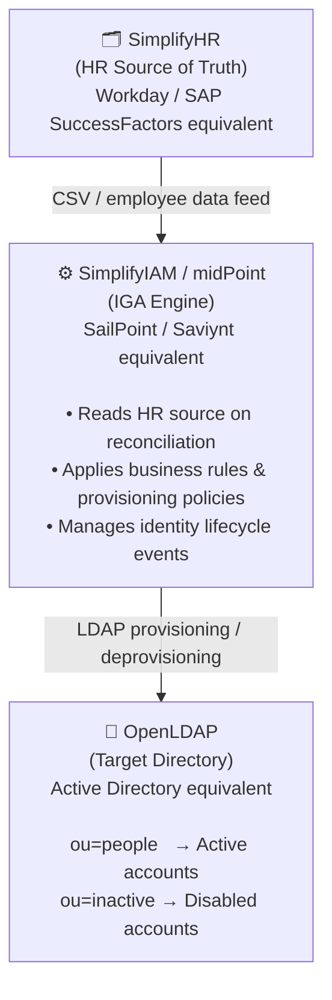

# iga-jml-automation-midpoint
Identity &amp; Access Management (IAM) Lab — JML Lifecycle Implementation

# Identity & Access Management (IAM) Lab — JML Lifecycle Implementation

> A hands-on lab implementing a fully automated **Joiner-Mover-Leaver (JML)** identity lifecycle using enterprise-grade IAM tooling — all running locally without cloud costs or vendor licenses.

---

## 📋 Project Overview

This lab demonstrates a production-representative **Identity Governance & Administration (IGA)** pipeline. I designed and executed a complete JML lifecycle automation by integrating three components — an HR source system, an IGA platform, and an LDAP directory — to provision, manage, and deprovision user accounts automatically based on HR-driven events.

This mirrors the core workflow that enterprise IAM teams implement across organizations with thousands of employees using platforms like **SailPoint**, **Saviynt**, **Workday**, and **Active Directory**.

---

## 🏗️ Architecture



### Real-World Equivalents

| Lab Component | Enterprise Equivalent |
|---|---|
| SimplifyHR | Workday, SAP SuccessFactors |
| SimplifyIAM (midPoint) | SailPoint IIQ, Saviynt, One Identity |
| OpenLDAP | Microsoft Active Directory, AD LDS |

---

## ⚙️ Tech Stack

| Tool | Role |
|---|---|
| **midPoint** | IGA platform — reconciliation, provisioning workflows, role management |
| **OpenLDAP / 389 Directory Server** | LDAP target directory with `ou=people` and `ou=inactive` OUs |
| **Flask (SimplifyHR)** | Simulated HR system writing employee records to CSV |
| **phpLDAPadmin** | LDAP browser for verifying account states |
| **VirtualBox** | Local VM hosting the full environment (CentOS Stream 9) |
| **SSH / mRemoteNG** | Remote access to the lab VM |

---

## 🔄 Workflows Implemented

### 1. Joiner Workflow — Onboarding

**Trigger:** New employee record added in SimplifyHR

**Automated Steps:**

1. Employee created in SimplifyHR (HR source of truth)
2. midPoint reconciliation task detects new HR record
3. midPoint creates an internal identity object
4. LDAP account automatically provisioned to `ou=people` with correct attributes (name, uid, department)
5. No manual directory interaction required

**Outcome:** New hire has a fully provisioned LDAP account seconds after HR data entry.

---

### 2. Leaver Workflow — Offboarding

**Trigger:** Employee status changed to `Terminated` in SimplifyHR

**Automated Steps:**

1. Employee terminated in SimplifyHR
2. midPoint reconciliation detects status change
3. Leaver workflow triggers — LDAP account disabled
4. Account moved automatically from `ou=people` → `ou=inactive`
5. Account retained (not deleted) per enterprise best practice

**Outcome:** Terminated employee loses access immediately and automatically upon HR action — no manual intervention, no access creep.

> [!NOTE]
> **Enterprise Best Practice:** Accounts are *disabled*, not deleted. Deletion follows a retention period of 30–90 days defined by organizational policy, preserving the ability to recover data or conduct investigations before permanent removal.

---

### 3. Rehire Workflow — Reactivation *(Bonus)*

**Trigger:** Employee status changed back to `Active` in SimplifyHR

**Automated Steps:**

1. Employee reactivated in SimplifyHR
2. midPoint reconciliation detects reactivation
3. LDAP account re-enabled and moved back to `ou=people`

**Outcome:** Rehired employees regain access automatically without requiring a new account to be created.

---

## 🛠️ Lab Environment Setup

### Prerequisites

| Requirement | Details |
|---|---|
| VirtualBox | Free — [virtualbox.org](https://virtualbox.org) |
| RAM | Minimum 8 GB (VM uses 6 GB) |
| Disk Space | 20 GB free |
| SSH Client | mRemoteNG (Windows) or Terminal (Mac) |

### Port Forwarding Rules

Verify these exist under **VM Settings → Network → Adapter 1 → Advanced → Port Forwarding** before starting the VM:

| Name | Host Port | Guest Port |
|---|---|---|
| SSH | 2222 | 22 |
| SimplifyIAM | 8080 | 8080 |
| SimplifyHR | 8085 | 8085 |
| phpLDAPadmin | 8089 | 8089 |

### Setup Steps

```bash
# Step 1: SSH into the VM (after importing OVA and starting in VirtualBox)
ssh -p 2222 openiam@127.0.0.1

# Step 2: Start all lab services
bash /home/openiam/start-lab.sh

# Step 3: Verify all services are healthy
bash /home/openiam/status-lab.sh
```

> [!TIP]
> SimplifyIAM is a Java application — allow **3–5 minutes** after running `start-lab.sh` before navigating to the dashboard.

### Service URLs

| Service | URL |
|---|---|
| SimplifyIAM (midPoint) | http://localhost:8080/midpoint |
| SimplifyHR | http://localhost:8085 |
| phpLDAPadmin | http://localhost:8089 |

---

## 🧪 Running the Workflows

### Joiner Test

```text
1. Open SimplifyHR → Add Employee
      First Name : Lucas
      Last Name  : Weber
      Department : Engineering
      Status     : Active

2. SimplifyIAM → Tasks → All Tasks → HR CSV Reconciliation → Run Now
   (wait 10–15 seconds for status to change from Running → Success)

3. Verify identity in SimplifyIAM:
   Users → All Users → Lucas Weber
   → Status: Active
   → Projections tab: one projection to OpenLDAP resource

4. Verify LDAP account in phpLDAPadmin:
   dc=simplifyiam,dc=com → ou=people → Lucas Weber entry present
   (entry should contain name, department, uid)
```

### Leaver Test

```text
1. Open SimplifyHR → Find James Anderson → Terminate → Confirm

2. SimplifyIAM → Tasks → All Tasks → HR CSV Reconciliation → Run Now

3. Verify in SimplifyIAM:
   Users → All Users → James Anderson
   → Status: Disabled
   → Projections tab: OpenLDAP projection shows account as disabled

4. Verify in phpLDAPadmin:
   dc=simplifyiam,dc=com → ou=inactive
   → James Anderson moved here automatically from ou=people
```

### Rehire Test *(Optional)*

```text
1. Open SimplifyHR → Find James Anderson → Reactivate

2. SimplifyIAM → Tasks → All Tasks → HR CSV Reconciliation → Run Now

3. Verify in phpLDAPadmin:
   dc=simplifyiam,dc=com → ou=people
   → James Anderson returned and re-enabled
```

---

## 📁 Key Log Locations

```bash
# midPoint (SimplifyIAM) logs
tail -f /opt/midpoint/midpoint-4.10/var/log/midpoint.log

# SimplifyHR logs
tail -f /tmp/simplifyhr.log

# 389 DS (OpenLDAP) access logs
tail -f /var/log/dirsrv/slapd-ldap1/access
```

---

## 💡 Key IAM Concepts Demonstrated

| Concept | Description |
|---|---|
| **JML Lifecycle** | Joiner-Mover-Leaver — the foundational framework of every IGA implementation |
| **Reconciliation** | midPoint compares HR source data against known identities to detect and act on changes |
| **Provisioning** | Automatic account creation in target systems based on HR-driven rules |
| **Deprovisioning** | Account disablement and OU relocation triggered by termination events |
| **Source of Truth** | HR system is authoritative — the directory reflects HR state, not the other way around |
| **Least Privilege** | Accounts provisioned with only the attributes and access defined by business rules |
| **Retention Policy** | Terminated accounts are disabled, not deleted, for audit trail and data recovery purposes |

---

## 🔗 Related Technologies


`IAM` · `IGA` · `JML Lifecycle` · `LDAP` · `Identity Reconciliation` · `Provisioning` · `Deprovisioning` · `Access Governance`
